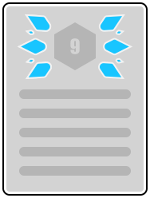

# Baka Theme for Milkdown

Baka Theme is a community theme for [Saul-Mirone/milkdown](https://github.com/Saul-Mirone/milkdown). 

## Our Goal

This theme aimed to be a alternative to official themes, and fulfill missing or currently unsupported features. This project will also provide a guideline to help people design their own milkdown themes with all official theme and baka theme features.

Currently, we are working on these goals.

- Iconify integration
- Bundled Prism.js Themes
- More markdown customizing options

You may mentioned that those can't be covered by just one theme. That means with reaching them, we will put efforts on improving milkdown, too. Our final goal is provide users and developers this theme with milkdown together, either a third-party package or a community contributed official package.

## License

This theme is licensed under the MIT License.
